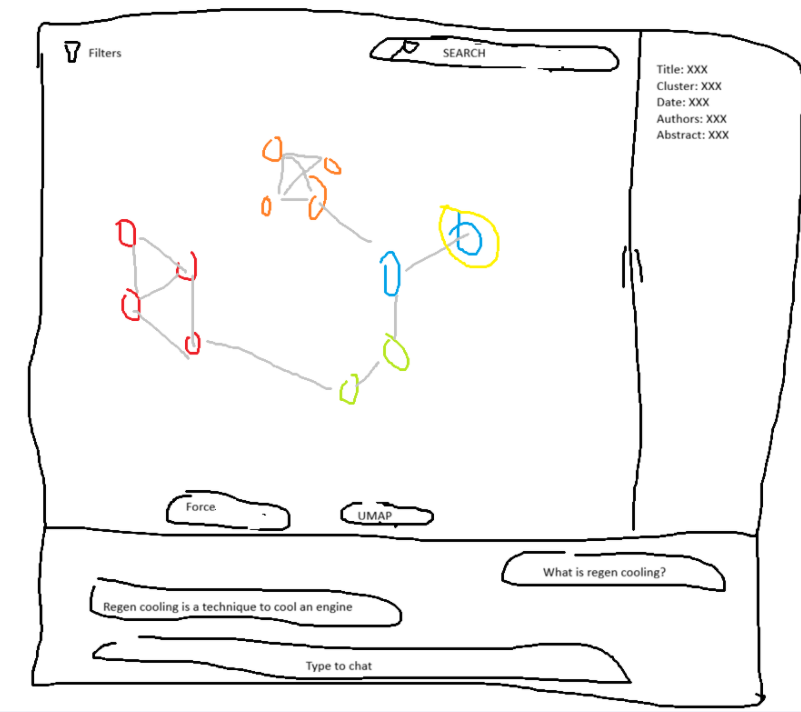

## Description of app layout

Layout should be the same at the of the Figure App layout. 

There are three panels:

- the bottom panel is a chat
- the main panel is the visualization of the network
- the right panel is the info panel when we click on a paper

The bottom panel is a chat window to talk to the llm so we can ask questions about a paper, a group of papers, a cluster or the network. 
We can make this panel bigger or smaller my moving a grabbing the horizontal line. 
This panel always stays at the bottom

The main panel is where we visualize the network. 
At the center of the panel, at the bottom right above the chat panel there are two bottoms. 
One Force the other UMAP, so that we can switch between force directed visualization and UMAP visualization. 
We shall be able to zoom and pan the network.
Hovering above the nodes displays the title.
Clicking a node shows its information on the right panel and highlights the node.
On the top left corner there is a filter bottom. 
When clickling on it we can select the filters. 
For now we will only be able to filter by cluster using the cluster names. 
The cluster names should have a circle of the associated colour before the name.
On top of the main panel there should be a search bar. 
The search bard allows us to type in keywords to search.
When pressing enter a dropdown list should appear with the relevant papers.
there should be a dropdown list on the search bar to have the options to select hybrid, semantic or lexi. 
Defualt should be hybrid.
When clicking on a search result, the node should be highlighted and the info should appear on the right pannel.

The right panel contains the information of the last clicked node. 
At the beginning it shows empty fields.
We can make it bigger or smaller by moving the left vertical line left and right.
It should display all relevant ifnromation that is available.
there should be a buttom to open the pdf.

